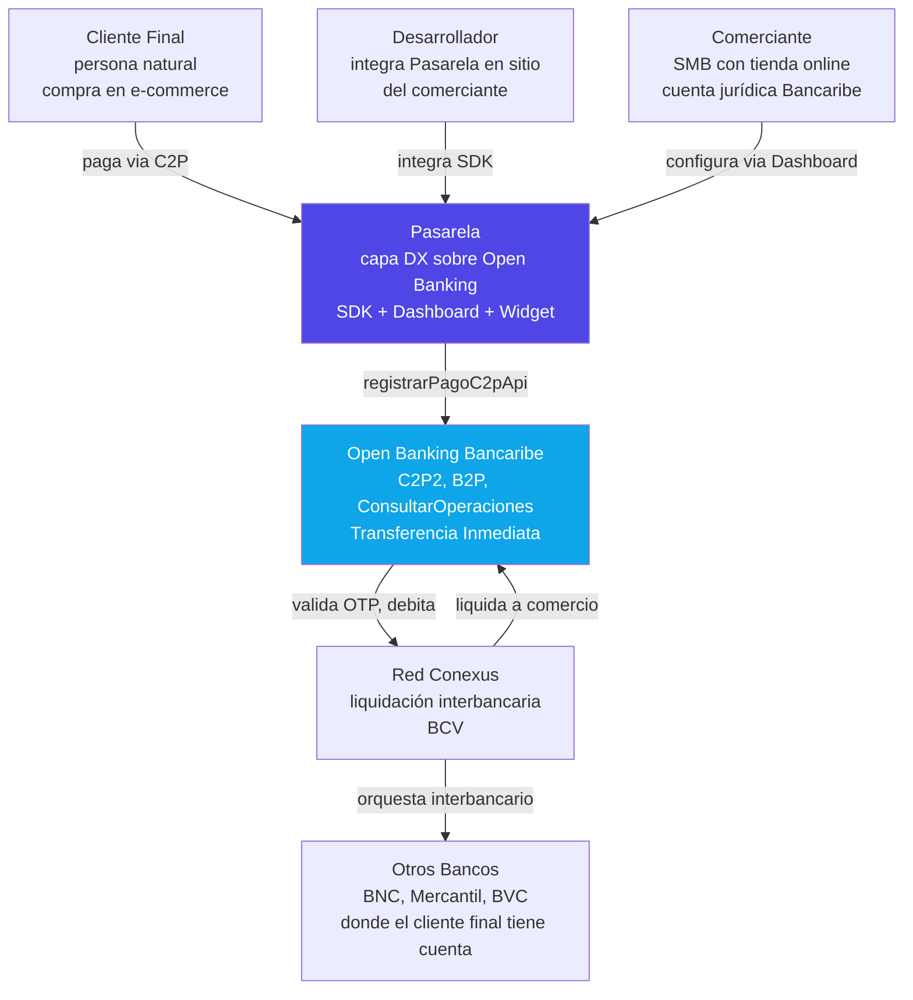
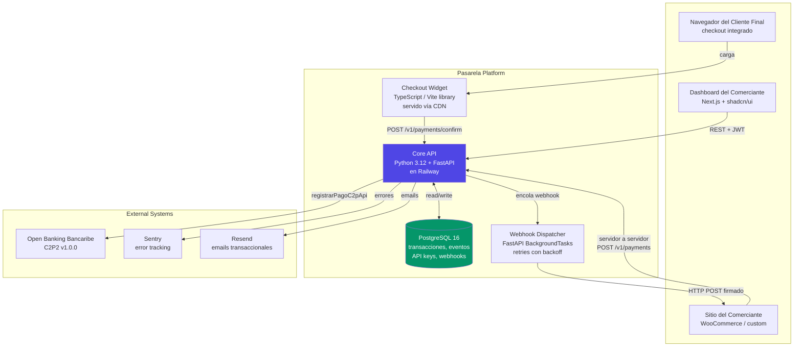
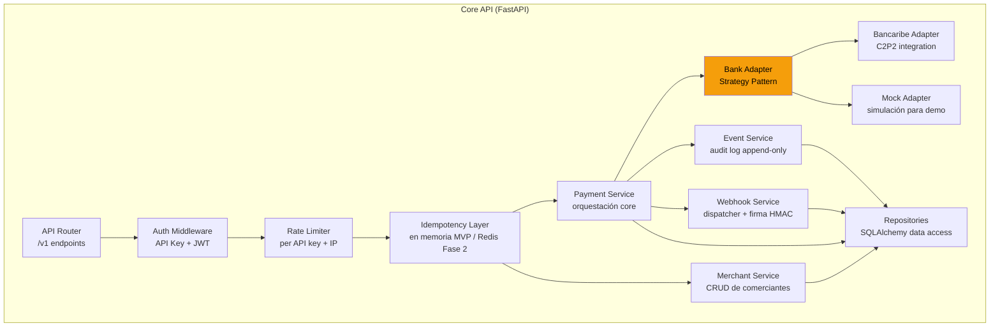

# 02 — Arquitectura del Sistema

> **Versión**: 1.0
> **Fecha**: 9 de mayo de 2026
> **Stack**: Python 3.12 / FastAPI / PostgreSQL / Next.js / TypeScript

Este documento describe la arquitectura del MVP (Fase 1) usando el modelo C4 (Context, Containers, Components). Las decisiones arquitectónicas tomadas aquí permiten evolución a Fase 2 (multi-banco) y Fase 3 (modelo agregador) sin reescritura.

---

## Nivel 1 — Diagrama de Contexto (System Context)



### Actores

| Actor | Descripción |
|---|---|
| **Cliente Final** | Persona natural con cuenta en cualquier banco venezolano que compra en una tienda integrada con Pasarela. |
| **Comerciante (SMB)** | Pequeña/mediana empresa con cuenta jurídica en Bancaribe. Es el usuario principal del Dashboard. |
| **Desarrollador** | Integrador técnico que conecta Pasarela al e-commerce del comerciante. Puede ser interno o agencia. |
| **Pasarela** | Nuestro sistema. Capa DX entre el comerciante y Bancaribe. |
| **Open Banking Bancaribe** | APIs del banco. Procesa C2P, valida OTP, ejecuta liquidación. |
| **Red Conexus / Otros Bancos** | Infraestructura interbancaria que valida la cuenta del cliente y mueve los fondos. |

---

## Nivel 2 — Diagrama de Containers



### Containers

| Container | Tecnología | Responsabilidad |
|---|---|---|
| **Core API** | Python 3.12, FastAPI, Pydantic v2, SQLAlchemy 2.0 | Endpoint REST, autenticación API key + JWT, orquestación de pagos, validación, generación de webhooks. |
| **PostgreSQL** | Postgres 16 (Railway) | Almacén transaccional. Esquema con audit log append-only. NUMERIC(19,4) para montos. |
| **Webhook Dispatcher** | FastAPI BackgroundTasks (MVP) → ARQ/Celery (Fase 2) | Envío asíncrono de webhooks a comerciantes. Reintentos exponenciales. Outbox pattern para garantía de entrega. |
| **Checkout Widget** | TypeScript, Vite library mode | Modal embebible. Self-contained CSS. ~30KB minificado. Servido vía Vercel CDN. |
| **Dashboard** | Next.js 15, TypeScript, Tailwind, shadcn/ui | UI del comerciante. SSR para SEO de la landing. Auth con Supabase. |
| **Sentry** | SaaS | Captura de errores en producción. |
| **Resend** | SaaS | Emails transaccionales (confirmaciones, recibos, alertas). |

---

## Nivel 3 — Diagrama de Componentes (Core API)



### Componentes clave

#### Bank Adapter (Strategy Pattern)

El componente más estratégico. Permite intercambiar la implementación bancaria sin tocar el core. En Fase 1 solo existe `BancaribeImpl` (más `MockImpl` para demo). En Fase 2 se agregarán `BNCImpl`, `MercantilImpl`, etc.

```python
# app/banking/base.py
from abc import ABC, abstractmethod
from app.banking.schemas import C2PRequest, C2PResponse, OperationStatus

class BankAdapter(ABC):
    """
    Interfaz base para adapters bancarios.
    Soporta modo Facilitator (Fase 1) y Aggregator (Fase 3).
    """

    @abstractmethod
    async def initiate_c2p(self, req: C2PRequest) -> C2PResponse:
        """
        Inicia un cobro C2P. En Fase 1 (facilitator) la liquidación
        va directo al comerciante. En Fase 3 (aggregator) iría a
        cuenta operativa apadrinada.
        """
        pass

    @abstractmethod
    async def query_operation(self, ref: str) -> OperationStatus:
        """Consulta el estado de una operación previamente iniciada."""
        pass

    @abstractmethod
    async def list_supported_banks(self) -> list[dict]:
        """Lista de bancos cuyas claves OTP puede validar."""
        pass

    @property
    @abstractmethod
    def supports_aggregator_mode(self) -> bool:
        """True solo si hay contrato de sub-agencia activo (Fase 3)."""
        pass
```

#### Idempotency Layer

Crítico para pagos. Cada `POST /v1/payments` requiere un header `Idempotency-Key`. Si llega la misma key dos veces, se devuelve la respuesta original sin reprocesar.

**MVP**: en memoria (dict con TTL). Suficiente para demo y baja concurrencia.
**Fase 2**: Redis con `SET NX EX 86400` para concurrencia distribuida.

#### Event Service (Audit Log)

Tabla `events` append-only. Cada cambio de estado de un payment, cada llamada al banco, cada webhook enviado se inserta como evento inmutable. Esto:

- Garantiza auditabilidad completa (requisito regulatorio en Fase 3)
- Permite reconstruir el estado de cualquier transacción
- Habilita event sourcing en Fase 3 sin cambios de modelo

#### Webhook Service (Outbox Pattern)

Los webhooks no se envían directamente desde el código que procesa el pago. Se insertan en una tabla `webhook_outbox` dentro de la **misma transacción de DB** que el cambio de estado del payment. Un dispatcher separado lee la tabla y envía con reintentos exponenciales (1m, 5m, 15m, 1h, 6h, 24h — esquema Stripe).

Esto garantiza que **ningún cambio de estado queda sin webhook** incluso si el servicio se cae justo después de procesar.

---

## Decisiones arquitectónicas (ADRs)

### ADR-001: FastAPI sobre alternativas (Django, Flask, Node.js)

**Contexto**: necesitamos un framework web async, tipado, con generación automática de OpenAPI.

**Decisión**: FastAPI + Pydantic v2.

**Razones**:
- Tipado fuerte con Pydantic — crítico para datos financieros (cédulas, teléfonos, montos).
- OpenAPI/Swagger auto-generado — alineado con filosofía developer-first.
- Async nativo — necesario para llamadas concurrentes a Bancaribe.
- Stack Python familiar para el equipo (proyectos previos validados).

**Trade-offs aceptados**: ecosistema de Python para fintech enterprise es menor que el de Java/Spring, pero suficiente para MVP y Fase 2.

### ADR-002: PostgreSQL como única DB transaccional

**Contexto**: necesitamos consistencia ACID estricta para transacciones financieras.

**Decisión**: PostgreSQL 16 con `SERIALIZABLE` isolation para escrituras críticas. NUMERIC(19,4) para todos los montos (nunca FLOAT).

**Alternativas descartadas**: NoSQL (MongoDB, DynamoDB) — pierden ACID. SQLite — no escala.

### ADR-003: Bank Adapter como Strategy Pattern

**Contexto**: Fase 1 es Bancaribe-only, pero Fase 2 requiere multi-banco.

**Decisión**: clase abstracta `BankAdapter` con implementaciones intercambiables. El core nunca conoce qué banco está hablando.

**Beneficio**: agregar BNC en Fase 2 es escribir un `BNCAdapter`, no modificar el core.

### ADR-004: Idempotency obligatoria en endpoints de escritura

**Contexto**: pagos no pueden duplicarse por reintentos del cliente.

**Decisión**: header `Idempotency-Key` obligatorio en `POST /v1/payments`. Respuestas cacheadas 24h.

**Implementación MVP**: dict en memoria con TTL.
**Implementación Fase 2**: Redis distribuido.

### ADR-005: Audit log append-only desde día 1

**Contexto**: Fase 3 (modelo agregador) requerirá auditoría regulatoria completa. Construir esto en MVP cuesta poco; agregar después es caro.

**Decisión**: tabla `events` con inserciones únicamente. Cada cambio de estado se registra como evento. Event sourcing-ready.

### ADR-006: Outbox pattern para webhooks

**Contexto**: webhooks no entregados son una causa común de bugs en pasarelas de pago.

**Decisión**: webhooks se insertan en tabla `webhook_outbox` dentro de la transacción del cambio de estado. Dispatcher separado consume la tabla.

**Beneficio**: garantía de entrega even si el servicio se reinicia.

### ADR-007: Monorepo con apps separadas

**Contexto**: 4 productos relacionados (API, Dashboard, Widget, Tienda Demo).

**Decisión**: monorepo con `apps/` y `packages/`. Sin herramientas pesadas tipo Nx (innecesario para MVP).

**Trade-off**: deploys separados (Railway para backend, Vercel para frontends), pero versiones sincronizadas vía Git.

---

## Capacidades preparadas para Fase 3 (Modelo Agregador)

El MVP incluye los siguientes ganchos arquitectónicos pensados para activarse cuando exista el contrato de sub-agencia con Bancaribe:

1. **Tabla `merchant_accounts`** con campo `bank` y `account_type` (preparada para múltiples bancos y para tipo "operativa apadrinada" en Fase 3).
2. **Campo `flow_mode`** en transacciones: `direct_to_merchant` (Fase 1) o `via_aggregator` (Fase 3, no implementado).
3. **Modelo de `settlement`** separado del modelo de `payment`: en Fase 1 son síncronos, en Fase 3 desacoplados.
4. **`BankAdapter.supports_aggregator_mode`**: flag que indica si el banco actual permite operación apadrinada.

---

## Diagrama de despliegue (deployment)

```
┌────────────────────────────────────────────────────────────────┐
│                      Cloudflare DNS + WAF                       │
└────────────────┬───────────────────────────┬───────────────────┘
                 │                           │
                 ▼                           ▼
┌──────────────────────────┐    ┌──────────────────────────┐
│  Vercel                   │    │  Railway                  │
│  ─────                    │    │  ─────                    │
│  - landing.pasarela.dev   │    │  - api.pasarela.dev       │
│  - app.pasarela.dev       │    │    (FastAPI + workers)    │
│  - tienda.pasarela.dev    │    │  - Postgres 16            │
│  - cdn.pasarela.dev/      │    │                           │
│    checkout.js            │    │                           │
└──────────────────────────┘    └──────────┬───────────────┘
                                            │
                                            ▼
                                ┌──────────────────────────┐
                                │  Bancaribe Open Banking   │
                                │  35ecb.bancaribe.com.ve   │
                                └──────────────────────────┘
```

---

## Próximos pasos

- Implementación del Core API (Día 2)
- Deploy en Railway (Día 3)
- Dashboard funcional (Día 3-4)
- Checkout Widget (Día 4-5)
- Documentación pública en `docs.pasarela.dev` (Día 6)
