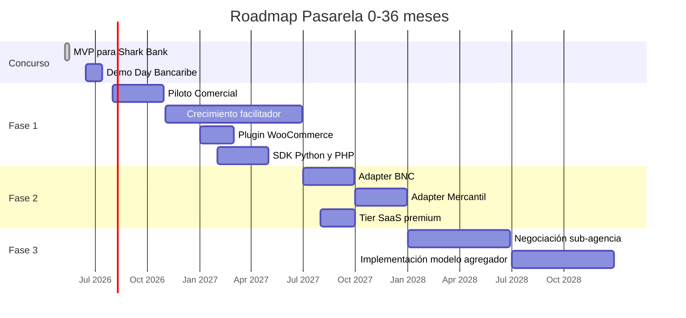

# 07 — Roadmap

> **Versión**: 1.0
> **Horizonte**: 0-36 meses
> **Estado**: Alineado con la propuesta a Shark Bank Bancaribe

Este roadmap traduce la visión de tres fases a hitos concretos, métricas verificables y dependencias claras. Es deliberadamente conservador en plazos para reflejar la realidad de un equipo de dos personas con ambición real.

---

## Visión consolidada

---

## Etapa 0 — MVP para Shark Bank (Mayo 2026)

**Duración**: 8 días.
**Estado**: 🚧 En curso (este repo).

### Entregables
- ✅ Documentación técnica completa (este documento incluido).
- 🚧 Backend FastAPI con endpoints clave (mock de Bancaribe).
- 🚧 Dashboard Next.js + shadcn con datos seed.
- 🚧 Checkout Widget embebible.
- 🚧 Tienda demo end-to-end.
- 🚧 Landing page profesional.
- 🚧 Pitch deck + video demo.
- 🚧 Formulario de aplicación a Shark Bank.

### Criterio de éxito
Aplicación enviada antes del **17 de mayo de 2026** con materiales que demuestren:
1. Comprensión profunda del Open Banking de Bancaribe.
2. Arquitectura técnica preparada para evolución (Bank Adapter, audit log, outbox).
3. Producto funcional demostrable end-to-end.
4. Visión de negocio clara con asociación simétrica.
5. Marco regulatorio entendido (no naive sobre Sudeban/BCV).

---

## Etapa 1 — Preselección y Demo Day (Junio-Julio 2026)

**Duración**: 4-6 semanas.
**Estado**: 🔵 Planificado.

### Si quedamos entre los 10-20 finalistas
- Llenado del segundo formulario técnico de Bancaribe.
- Preparación del Demo Day (pitch en vivo, demo técnica).
- Refinamiento del MVP basado en feedback de la preselección.
- Investigación profunda del contrato de revenue share preferencial.

### Si no quedamos seleccionados
- Aplicación al siguiente ciclo (típicamente anual).
- Continuación del desarrollo como side-project con fondeo propio.
- Búsqueda de partnerships con otros bancos como plan B.

---

## Fase 1 — Facilitador C2P sobre Bancaribe (Agosto 2026 - Julio 2027)

**Duración**: ~12 meses.
**Premisa**: ganamos Shark Bank o equivalente.

### Q3 2026 (Ago-Oct): Piloto Comercial

**Objetivo**: validar product-market-fit con 5-10 comerciantes seleccionados por Bancaribe.

**Entregables**:
- Integración real con `registrarPagoC2pApi` de C2P2 (no mock).
- Sistema de conciliación con archivos de Bancaribe.
- Anti-fraude básico (límites por comerciante, alertas de anomalías).
- Soporte directo a los primeros comerciantes (Slack/WhatsApp dedicado).
- Cumplimiento KYC básico de comerciantes (RIF + verificación documental).

**Métricas objetivo**:
- 5-10 comerciantes activos.
- 500-2000 transacciones procesadas.
- Tasa de aprobación >95%.
- Latencia P95 <8s (incluyendo Bancaribe).
- 0 incidentes con afectación a fondos.
- NPS comerciantes >40.

### Q4 2026 (Nov-Ene): Hardening y crecimiento inicial

**Objetivo**: pasar de piloto a operación abierta a comerciantes Bancaribe.

**Entregables**:
- Pen test externo (estimado $3K-$5K USD).
- Migración a infraestructura productiva (Railway pro tier o AWS).
- Redis para idempotencia distribuida y rate limiting.
- 2FA obligatorio en dashboard.
- Cifrado determinístico de cédulas/teléfonos.
- Onboarding self-service (sin necesidad de aprobación manual).
- Sistema de soporte: ticketing básico + base de conocimiento.

**Métricas objetivo**:
- 30-50 comerciantes activos.
- 5K-15K transacciones/mes.
- Documentación pública en `docs.pasarela.dev`.

### Q1 2027 (Feb-Abr): Plugins y ecosistema

**Objetivo**: reducir el costo de integración a cero.

**Entregables**:
- Plugin oficial para **WooCommerce** (gratis en repositorio).
- SDK oficial en **Python** (PyPI).
- SDK oficial en **PHP** (Packagist).
- Tutorial de integración con plataformas comunes (Wix, Tiendanube).
- Programa de referidos para desarrolladores.

**Métricas objetivo**:
- 100+ comerciantes activos.
- 30K-50K transacciones/mes.
- $200K-$500K USD volumen mensual.
- 3+ plugins/SDKs públicos con tracción.

### Q2 2027 (May-Jul): Productos add-on (Fase 1.5)

**Objetivo**: aumentar take rate con productos premium.

**Entregables**:
- **Pasarela Recurring**: facturación recurrente para suscripciones.
- **Pasarela Analytics**: dashboard avanzado con métricas de cohortes.
- **Pasarela Anti-Fraude**: scoring básico de transacciones.
- **API de Reportes**: para integraciones contables.

**Métricas objetivo**:
- 200-300 comerciantes activos.
- $1M+ USD volumen mensual.
- 20% de comerciantes en planes premium.
- ARR (Annual Recurring Revenue) inicial >$50K USD.

---

## Fase 2 — Multi-banco facilitador (Julio 2027 - Julio 2028)

**Duración**: ~12 meses.
**Premisa**: producto validado en Fase 1, equipo de 4-6 personas.

### Q3 2027: Adapter BNC

**Objetivo**: romper la dependencia de un solo banco manteniendo a Bancaribe como founding partner.

**Entregables**:
- Negociación e integración con BNC (Banco Nacional de Crédito).
- Bank Adapter para BNC siguiendo Strategy Pattern existente.
- UI en dashboard para que el comerciante elija qué banco quiere como adquirente.
- Mantenimiento de condiciones preferenciales con Bancaribe (founding partner).

**Métricas objetivo**:
- 400-600 comerciantes activos.
- 30% comerciantes con cuenta BNC.
- $3M+ USD volumen mensual.

### Q4 2027: Adapter Mercantil + tier enterprise

**Entregables**:
- Adapter para Banco Mercantil.
- Tier "Enterprise" con SLA garantizado, cuenta dedicada, integración custom.
- Multi-divisa básica (VES + USD).
- Webhooks 2.0: filtrado avanzado de eventos, replay automático con UI.

**Métricas objetivo**:
- 600-1000 comerciantes activos.
- $5M-$10M USD volumen mensual.
- 3 clientes enterprise contratados.

### Q1-Q2 2028: Expansión completa

**Entregables**:
- Adapter para BVC (Banco Venezolano de Crédito).
- Adapter para Banesco (negociación más larga).
- Marketplace de plugins (terceros pueden publicar integraciones).
- Programa de partners (agencias digitales que implementan Pasarela).

**Métricas objetivo**:
- 1500+ comerciantes activos.
- $15M+ USD volumen mensual.
- 4+ bancos integrados.
- Bancaribe mantiene >40% del volumen.

---

## Fase 3 — Modelo Agregador apadrinado (Julio 2028+)

**Duración**: 12+ meses.
**Premisa**: Bancaribe acepta el rol de banco apadrinador para modelo agregador.

### Pre-requisitos (críticos)
- Track record de 18+ meses operando como facilitador sin incidentes.
- Volumen sostenido > $10M USD/mes.
- Equipo de 8-12 personas con roles especializados.
- Capital o financiamiento para bond/garantía ($20K-$100K USD).
- Abogado fintech-especializado dedicado.

### H2 2028: Negociación y setup

**Entregables**:
- Contrato de sub-agencia / corresponsalía no bancaria con Bancaribe firmado.
- Apertura de cuenta operativa apadrinada.
- Implementación de KYC/AML real con software especializado (ComplyAdvantage, Sumsub o similar).
- Política de prevención de LC/FT/FPADM formal con oficial designado.
- Implementación técnica del modo `via_aggregator` en Bank Adapter.

### H1 2029: Modo agregador limitado

**Entregables**:
- Modo agregador disponible solo para comerciantes ya validados de Fase 1-2 (sin acceso público).
- Liquidación T+1 inicial.
- Reportes regulatorios mensuales a Bancaribe (que reporta a UIF/Sudeban).
- Bond/garantía operativa.

**Métricas objetivo**:
- 100-200 comerciantes en modo agregador.
- $5M+ USD/mes en modo agregador.
- Cero discrepancias en conciliación regulatoria.

### H2 2029+: Productos avanzados habilitados por agregador

**Entregables**:
- **Pasarela Connect**: split payments para marketplaces (modelo Stripe Connect).
- **Pasarela Escrow**: retención condicional de fondos.
- **Pasarela Capital**: financiamiento a comerciantes basado en flujo (modelo Stripe Capital).
- **Pasarela Multi-Currency**: liquidación en USD/USDT vía partners.
- **Liquidación T+0**: para comerciantes premium.

### 2030+: Independencia regulatoria

**Posibles caminos**:
- Aplicación a licencia IPSP propia ante Sudeban con track record demostrado.
- Conversión a institución financiera no bancaria.
- Expansión regional (Colombia, otros países LATAM).

---

## Productos en el ecosistema (resumen)

| Producto | Fase | Take rate |
|---|---|---|
| **Pasarela Payments** (C2P) | Fase 1 | Revenue share Bancaribe |
| **Pasarela Recurring** (suscripciones) | Fase 1.5 | +0.5% sobre payment |
| **Pasarela Analytics** | Fase 1.5 | Suscripción $20-50/mes |
| **Pasarela Anti-Fraude** | Fase 1.5 | $0.05 USD por transacción screened |
| **Pasarela Plugins** (WooCommerce, etc.) | Fase 1.5 | Gratis (acquisition driver) |
| **Pasarela Multi-Bank** | Fase 2 | Revenue share del banco elegido |
| **Pasarela Enterprise** | Fase 2 | Suscripción anual + comisiones |
| **Pasarela Connect** (marketplaces) | Fase 3 | 1.5%-2.5% directo |
| **Pasarela Escrow** | Fase 3 | Fee fijo por escrow |
| **Pasarela Capital** | Fase 3 | Interés sobre préstamos |
| **Pasarela Multi-Currency** | Fase 3 | Spread cambiario |

---

## Hiring roadmap

| Trimestre | Headcount total | Roles agregados |
|---|---|---|
| Q3 2026 | 2 | Tú + Co-founder |
| Q4 2026 | 3 | + 1 Senior Backend Engineer |
| Q1 2027 | 4 | + 1 Frontend Engineer |
| Q2 2027 | 5 | + 1 Customer Success / Support |
| Q3 2027 | 7 | + 2 (DevOps, Security) |
| Q4 2027 | 9 | + 2 (Product Manager, Sales) |
| Q1 2028 | 12 | + 3 (Engineers, Compliance Officer) |
| H2 2028 | 18 | Equipo de Fase 3 (Risk, Legal, Compliance) |

---

## Riesgos del roadmap

| Riesgo | Probabilidad | Impacto | Mitigación |
|---|---|---|---|
| **No ganar Shark Bank** | Media | Alto | Aplicar a otros concursos (Open Banking BBVA, Wayra LATAM); seguir desarrollo con fondeo propio. |
| **Bancaribe cambia de estrategia** | Baja | Alto | Fase 2 con BNC/Mercantil reduce dependencia. |
| **Sudeban endurece regulación de TPPs** | Media | Medio | Operar bajo paraguas Bancaribe en Fase 1; mantener diálogo regulatorio activo. |
| **Cashea o Megasoft pivotean al SMB** | Media | Alto | Velocidad de ejecución; foco en DX (su debilidad). |
| **Crisis cambiaria afecta volumen** | Alta | Medio | Multi-divisa desde Fase 2; comerciantes B2B dolarizados. |
| **Talent crunch (ingenieros venezolanos)** | Alta | Medio | Remote-first desde día 1; salarios competitivos en USD. |

---

## Indicadores de éxito por fase

### Indicadores de salud Fase 1

- ✅ NPS comerciantes >40
- ✅ Churn mensual <5%
- ✅ Tasa de aprobación >95%
- ✅ Uptime >99.5%
- ✅ Tiempo de respuesta a soporte <4h

### Indicadores de éxito comercial Fase 2

- ✅ Crecimiento MoM volumen >15%
- ✅ Mix de bancos: ningún banco >70%
- ✅ ARR creciendo >$100K trimestral
- ✅ CAC payback <12 meses
- ✅ Plugins instalados >5K WooCommerce

### Indicadores de éxito Fase 3

- ✅ Aprobación regulatoria sin observaciones críticas
- ✅ Margen operativo >40%
- ✅ Productos avanzados representan >30% del revenue
- ✅ Equipo retenido >85% anual
- ✅ Bancaribe satisfecho como partner (anchor del modelo)
