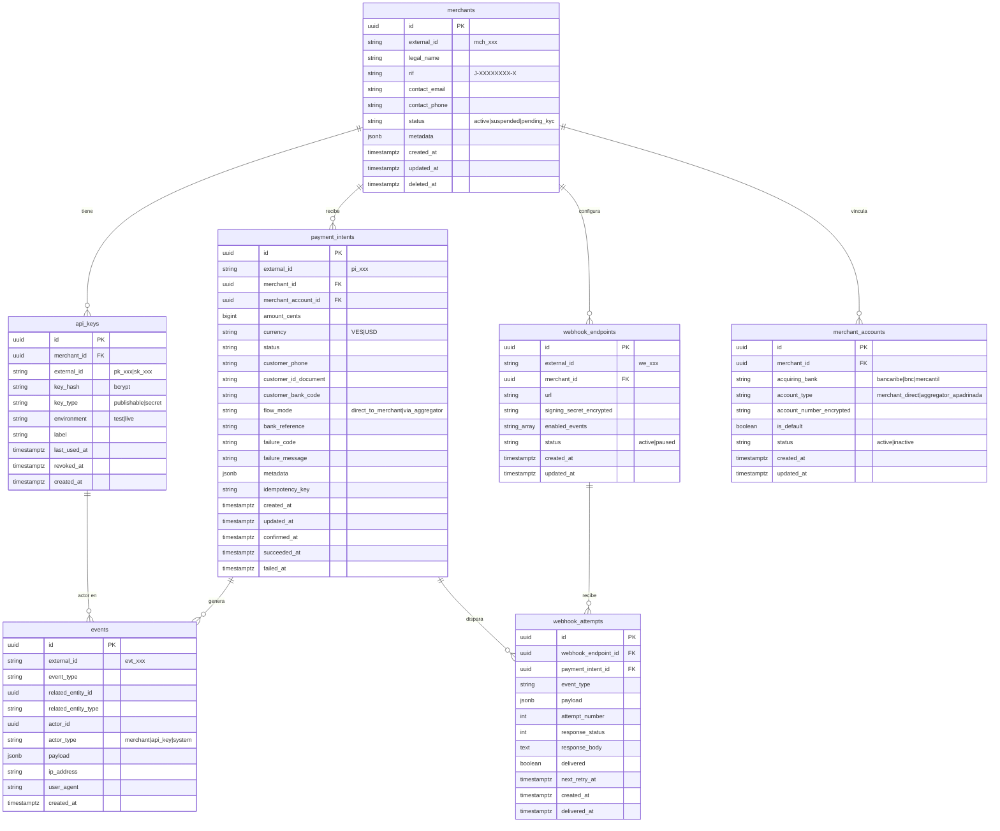
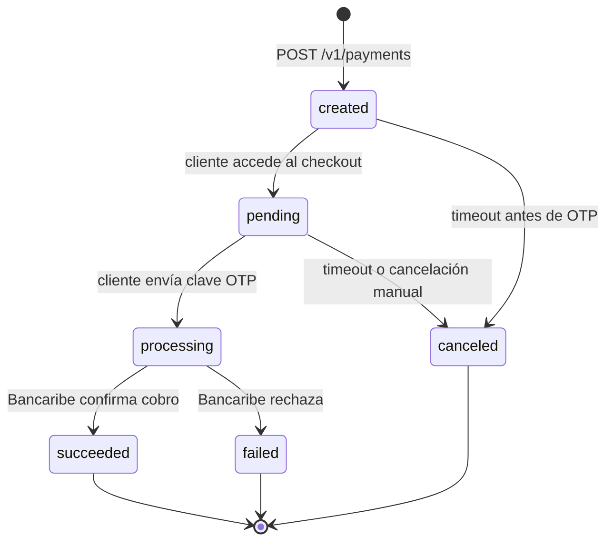

# 03 — Modelo de Datos

> **Versión**: 1.1
> **DBMS**: PostgreSQL 16
> **Convención**: snake_case, plurales para tablas, IDs prefijados estilo Stripe
> **Migración actual**: `alembic/versions/3ca9bba912db_20260511_initial_schema.py`

---

## Principios de diseño

1. **Audit-first**: tabla `events` append-only registra cada cambio relevante.
2. **Money-safe**: montos en `BIGINT` céntimos (`amount_cents`) — enteros, no FLOAT. Currency explícito.
3. **Soft deletes** con `deleted_at` NULL (solo `merchants` en MVP).
4. **UUIDs como PKs** internas + IDs externos prefijados para APIs.
5. **DateTime** server-default `now()`. UTC en DB, conversión en presentación. (Nota: migración usa `sa.DateTime()` — upgrade a `TIMESTAMPTZ` planeado.)
6. **Preparado para Fase 3**: campos como `flow_mode`, `acquiring_bank`, `account_type` ya presentes.

---

## ER Diagram



---

## Nota sobre los DDL siguientes

Los DDL mostrados representan el **diseño objetivo**. La migración actual `3ca9bba912db_20260511_initial_schema.py` crea todas las tablas con sus columnas pero **omite los CHECK constraints** (formato RIF, formato teléfono/cédula, validación de status/currency/account_type) y los índices secundarios listados. Plan: agregarlos en migración subsiguiente Día 6.

## Tablas en detalle

### `merchants`

Comerciantes registrados en la plataforma. Fase 1: deben tener cuenta jurídica en Bancaribe.

```sql
CREATE TABLE merchants (
    id UUID PRIMARY KEY DEFAULT gen_random_uuid(),
    external_id VARCHAR(40) UNIQUE NOT NULL,  -- 'mch_<random>'
    legal_name VARCHAR(255) NOT NULL,
    rif VARCHAR(15) UNIQUE NOT NULL,  -- 'J-12345678-9'
    contact_email VARCHAR(255) NOT NULL,
    contact_phone VARCHAR(20),
    status VARCHAR(32) NOT NULL DEFAULT 'pending_kyc',
        -- 'pending_kyc', 'active', 'suspended', 'closed'
    metadata JSONB NOT NULL DEFAULT '{}',
    created_at TIMESTAMPTZ NOT NULL DEFAULT now(),
    updated_at TIMESTAMPTZ NOT NULL DEFAULT now(),
    deleted_at TIMESTAMPTZ,
    
    CONSTRAINT rif_format CHECK (rif ~ '^[VEJGP]-\d{8}-\d$')
);

CREATE INDEX idx_merchants_status ON merchants(status) WHERE deleted_at IS NULL;
CREATE INDEX idx_merchants_rif ON merchants(rif);
```

### `api_keys`

API keys con prefijo estilo Stripe. `key_hash` se almacena con bcrypt; el valor en texto plano solo se muestra una vez al crear.

```sql
CREATE TABLE api_keys (
    id UUID PRIMARY KEY DEFAULT gen_random_uuid(),
    merchant_id UUID NOT NULL REFERENCES merchants(id),
    external_id VARCHAR(80) UNIQUE NOT NULL,  -- 'sk_test_<random>' o 'pk_test_<random>'
    key_hash VARCHAR(255) NOT NULL,
    key_type VARCHAR(16) NOT NULL,  -- 'publishable', 'secret'
    environment VARCHAR(8) NOT NULL,  -- 'test', 'live'
    label VARCHAR(100),
    last_used_at TIMESTAMPTZ,
    revoked_at TIMESTAMPTZ,
    created_at TIMESTAMPTZ NOT NULL DEFAULT now(),
    
    CONSTRAINT key_type_valid CHECK (key_type IN ('publishable', 'secret')),
    CONSTRAINT environment_valid CHECK (environment IN ('test', 'live'))
);

CREATE INDEX idx_api_keys_merchant ON api_keys(merchant_id) WHERE revoked_at IS NULL;
CREATE INDEX idx_api_keys_external_id ON api_keys(external_id) WHERE revoked_at IS NULL;
```

### `merchant_accounts`

Cuentas bancarias del comerciante. En Fase 1 siempre `acquiring_bank='bancaribe'` y `account_type='merchant_direct'`. Estructura preparada para Fase 2 (multi-banco) y Fase 3 (cuenta apadrinada operativa).

```sql
CREATE TABLE merchant_accounts (
    id UUID PRIMARY KEY DEFAULT gen_random_uuid(),
    merchant_id UUID NOT NULL REFERENCES merchants(id),
    acquiring_bank VARCHAR(32) NOT NULL,  -- 'bancaribe' (Fase 1)
    account_type VARCHAR(32) NOT NULL DEFAULT 'merchant_direct',
        -- 'merchant_direct' (Fase 1: dinero va al comerciante)
        -- 'aggregator_apadrinada' (Fase 3: dinero va a cuenta operativa)
    account_number_encrypted BYTEA NOT NULL,  -- pgcrypto
    is_default BOOLEAN NOT NULL DEFAULT true,
    status VARCHAR(16) NOT NULL DEFAULT 'active',
    created_at TIMESTAMPTZ NOT NULL DEFAULT now(),
    updated_at TIMESTAMPTZ NOT NULL DEFAULT now(),
    
    CONSTRAINT account_type_valid CHECK (
        account_type IN ('merchant_direct', 'aggregator_apadrinada')
    )
);

CREATE INDEX idx_merchant_accounts_merchant ON merchant_accounts(merchant_id);
CREATE UNIQUE INDEX idx_merchant_accounts_default 
    ON merchant_accounts(merchant_id) 
    WHERE is_default = true AND status = 'active';
```

### `payment_intents`

El corazón del sistema. State machine bien definida.

```sql
CREATE TABLE payment_intents (
    id UUID PRIMARY KEY DEFAULT gen_random_uuid(),
    external_id VARCHAR(40) UNIQUE NOT NULL,  -- 'pi_<random>'
    merchant_id UUID NOT NULL REFERENCES merchants(id),
    merchant_account_id UUID NOT NULL REFERENCES merchant_accounts(id),
    
    -- Money: NUNCA usar FLOAT
    amount_cents BIGINT NOT NULL,  -- en céntimos para evitar decimales
    currency VARCHAR(3) NOT NULL,  -- 'VES', 'USD'
    
    -- State machine
    status VARCHAR(32) NOT NULL DEFAULT 'created',
        -- 'created' -> 'pending' -> 'processing' -> 'succeeded'/'failed'/'canceled'
    
    -- Datos del cliente final (necesarios para C2P)
    customer_phone VARCHAR(20) NOT NULL,
    customer_id_document VARCHAR(15) NOT NULL,  -- 'V12345678'
    customer_bank_code VARCHAR(8) NOT NULL,  -- código ABA del banco del cliente
    
    -- Modo de flujo (preparado para Fase 3)
    flow_mode VARCHAR(32) NOT NULL DEFAULT 'direct_to_merchant',
        -- 'direct_to_merchant' (Fase 1)
        -- 'via_aggregator' (Fase 3, no usado aún)
    
    -- Referencia bancaria
    bank_reference VARCHAR(100),  -- ID que devuelve Bancaribe
    
    -- Errores
    failure_code VARCHAR(50),
    failure_message TEXT,
    
    -- Idempotencia
    idempotency_key VARCHAR(100),
    
    metadata JSONB NOT NULL DEFAULT '{}',
    
    -- Timestamps de transición
    created_at TIMESTAMPTZ NOT NULL DEFAULT now(),
    updated_at TIMESTAMPTZ NOT NULL DEFAULT now(),
    confirmed_at TIMESTAMPTZ,  -- cuando se envió clave OTP
    succeeded_at TIMESTAMPTZ,
    failed_at TIMESTAMPTZ,
    
    CONSTRAINT amount_positive CHECK (amount_cents > 0),
    CONSTRAINT currency_valid CHECK (currency IN ('VES', 'USD')),
    CONSTRAINT status_valid CHECK (status IN (
        'created', 'pending', 'processing', 'succeeded', 'failed', 'canceled'
    )),
    CONSTRAINT customer_id_format CHECK (customer_id_document ~ '^[VEJGP]\d{6,9}$'),
    CONSTRAINT customer_phone_format CHECK (customer_phone ~ '^04\d{9}$')
);

CREATE INDEX idx_payment_intents_merchant_created 
    ON payment_intents(merchant_id, created_at DESC);
CREATE INDEX idx_payment_intents_status 
    ON payment_intents(status) WHERE status IN ('pending', 'processing');
CREATE UNIQUE INDEX idx_payment_intents_idempotency 
    ON payment_intents(merchant_id, idempotency_key) 
    WHERE idempotency_key IS NOT NULL;
```

### `webhook_endpoints`

URLs configuradas por el comerciante para recibir notificaciones.

```sql
CREATE TABLE webhook_endpoints (
    id UUID PRIMARY KEY DEFAULT gen_random_uuid(),
    external_id VARCHAR(40) UNIQUE NOT NULL,  -- 'we_<random>'
    merchant_id UUID NOT NULL REFERENCES merchants(id),
    url VARCHAR(500) NOT NULL,
    signing_secret_encrypted BYTEA NOT NULL,
    enabled_events TEXT[] NOT NULL DEFAULT ARRAY['*'],
        -- ['*'] o ['payment.succeeded', 'payment.failed', ...]
    status VARCHAR(16) NOT NULL DEFAULT 'active',  -- 'active', 'paused'
    created_at TIMESTAMPTZ NOT NULL DEFAULT now(),
    updated_at TIMESTAMPTZ NOT NULL DEFAULT now(),
    
    CONSTRAINT url_https CHECK (url ~ '^https://')
);

CREATE INDEX idx_webhook_endpoints_merchant 
    ON webhook_endpoints(merchant_id) WHERE status = 'active';
```

### `webhook_attempts`

Registra cada intento de envío de webhook. Si falla, agenda reintento con backoff exponencial.

```sql
CREATE TABLE webhook_attempts (
    id UUID PRIMARY KEY DEFAULT gen_random_uuid(),
    webhook_endpoint_id UUID NOT NULL REFERENCES webhook_endpoints(id),
    payment_intent_id UUID REFERENCES payment_intents(id),
    event_type VARCHAR(50) NOT NULL,
    payload JSONB NOT NULL,
    attempt_number INT NOT NULL DEFAULT 1,
    response_status INT,
    response_body TEXT,
    delivered BOOLEAN NOT NULL DEFAULT false,
    next_retry_at TIMESTAMPTZ,
    created_at TIMESTAMPTZ NOT NULL DEFAULT now(),
    delivered_at TIMESTAMPTZ
);

CREATE INDEX idx_webhook_attempts_pending 
    ON webhook_attempts(next_retry_at) 
    WHERE delivered = false AND next_retry_at IS NOT NULL;
CREATE INDEX idx_webhook_attempts_endpoint 
    ON webhook_attempts(webhook_endpoint_id, created_at DESC);
```

### `events`

Audit log inmutable. **Nunca se hace UPDATE ni DELETE**.

```sql
CREATE TABLE events (
    id UUID PRIMARY KEY DEFAULT gen_random_uuid(),
    external_id VARCHAR(40) UNIQUE NOT NULL,  -- 'evt_<random>'
    event_type VARCHAR(100) NOT NULL,
        -- 'payment.created', 'payment.confirmed', 'payment.succeeded', etc.
    related_entity_id UUID,
    related_entity_type VARCHAR(50),  -- 'payment_intent', 'merchant', etc.
    actor_id UUID,  -- merchant_id o api_key_id
    actor_type VARCHAR(32),  -- 'merchant', 'api_key', 'system', 'webhook'
    payload JSONB NOT NULL DEFAULT '{}',
    ip_address INET,
    user_agent TEXT,
    created_at TIMESTAMPTZ NOT NULL DEFAULT now()
    
    -- Sin UPDATED_AT: estos registros son inmutables
);

CREATE INDEX idx_events_entity 
    ON events(related_entity_id, created_at DESC);
CREATE INDEX idx_events_type_created 
    ON events(event_type, created_at DESC);
CREATE INDEX idx_events_actor 
    ON events(actor_id, created_at DESC) WHERE actor_id IS NOT NULL;

-- Particionamiento por mes (futuro, cuando crezca el volumen)
-- ALTER TABLE events PARTITION BY RANGE (created_at);
```

---

## State Machine de `payment_intents`



**State machine MVP (simplificada)**: el código actual maneja sólo `created` → `succeeded`/`failed`. Los estados intermedios `pending`/`processing`/`canceled` están en el diseño pero no en el endpoint `confirm` actual.

| Desde | Hacia | Trigger | Estado MVP |
|---|---|---|---|
| `created` | `succeeded` | `POST /confirm` + bank OK | ✅ implementado |
| `created` | `failed` | `POST /confirm` + bank rechaza (`ValueError`) | ✅ implementado |
| `created` / `requires_confirmation` | otros | flujo completo | 🟡 diseñado, pendiente |
| `created` | `canceled` | Timeout 15 min | 🟡 job pendiente |

Nota: `app/api/v1/payments.py` también acepta `requires_confirmation` como estado válido de entrada al `confirm`, pero ninguna ruta produce este estado aún.

**Transiciones prohibidas** (lanzan excepción):
- `succeeded` → cualquier otro (final state, irreversible)
- `failed` → `succeeded` (debe crearse nuevo `payment_intent`)
- Saltos de estado (ej: `created` → `succeeded` directamente)

---

## Convenciones de IDs externos

| Entidad | Prefijo | Ejemplo |
|---|---|---|
| Merchant | `merch_` | `merch_dev_001` |
| Payment Intent | `pi_` | `pi_x9y8z7w6v5u4` |
| API Key (publishable, planeado) | `pk_test_` / `pk_live_` | `pk_test_51HxYzABC...` |
| API Key (secret, MVP) | `sk_test_` / `sk_live_` (entrega) — interno `ak_` en `external_id` | `sk_test_dev_pasarela_001` |
| Webhook Endpoint | `whep_` | `whep_q7w8e9r0t1y2` |
| Webhook Attempt | `whatt_` | `whatt_3f4g5h6j7k8l` |
| Event | `evt_` (planeado) | — |

Generación MVP: prefijo + `secrets.token_urlsafe(16)` (≈22 chars base64url). Plan: estandarizar a 24 chars base62.

---

## Migraciones (Alembic)

Todas las migraciones se versionan en `apps/core-api/alembic/versions/`. Convención de nombrado:

```
YYYYMMDD_HHMM_<descripcion_corta>.py
```

Ejemplo: `20260509_1400_initial_schema.py`

---

## Consideraciones de seguridad

- **Datos sensibles cifrados** (diseño): `account_number_encrypted`, `signing_secret_encrypted` deben usar `pgcrypto` con clave maestra en env. **Estado MVP**: columnas `BYTEA` existen pero almacenan **bytes plano** (`secret.encode("utf-8")`). Cifrado pgcrypto pendiente Día 6/7.
- **API keys**: hash SHA256 con pepper (`API_KEY_PEPPER` env). Plan: migrar a bcrypt cost 12 en Fase 2.
- **Cédulas y teléfonos**: en MVP almacenados en plano (necesarios para validar OTP). En Fase 2 cifrado determinístico.
- **Backups**: Postgres en plataforma (Railway/Supabase) con backups automáticos diarios.
- **Replicación**: en Fase 2 se agrega read replica para reportes y dashboard.

---

## Volumen estimado (Fase 1 — Año 1)

| Tabla | Filas estimadas | Crecimiento mensual |
|---|---|---|
| merchants | 100-500 | +50/mes |
| api_keys | 200-1000 | +100/mes |
| merchant_accounts | 100-500 | +50/mes |
| payment_intents | 10K-100K | +10K-50K/mes |
| webhook_endpoints | 100-500 | +50/mes |
| webhook_attempts | 30K-300K | +30K-150K/mes |
| events | 100K-1M | +100K-500K/mes |

A volumen Fase 2 (1M+ payments/mes), la tabla `events` se particionará por mes y se moverán datos antiguos a almacenamiento frío (S3/R2).
