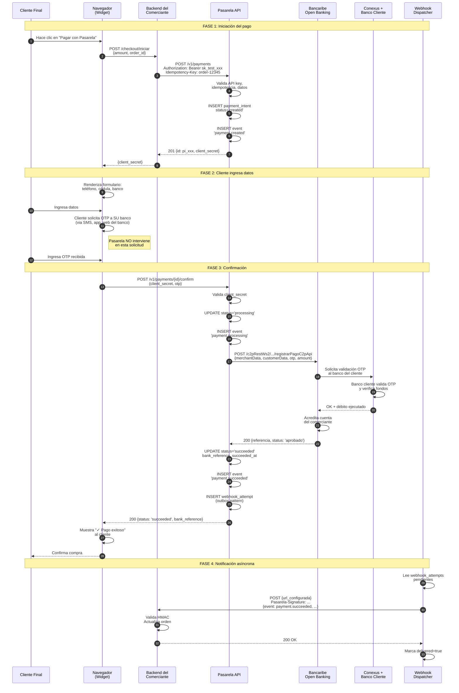

# 05 — Flujo C2P End-to-End

> **Versión**: 1.1
> **Aplica a**: Fase 1 (modelo facilitador)

Este documento detalla el flujo técnico **objetivo** del cobro C2P. Las secciones marcadas 🟡 son diseño aún no implementado en el MVP actual.

## Estado MVP (11-may-2026)

El backend implementa la versión simplificada:
- `POST /v1/payments` → crea intent en estado `created`, emite evento `payment_intent.created`, encola webhook outbox + dispatch background.
- `POST /v1/payments/{id}/confirm` → usa `MockBankAdapter` (80% éxito aleatorio, latencia 1-3s). Transición directa `created` → `succeeded`/`failed`. Sin estados intermedios `pending`/`processing`.
- Webhook firmado HMAC-SHA256 (`X-Pasarela-Signature: t=...,v1=...`), un único intento.

No implementado (🟡): integración real Bancaribe (`BancaribeAdapter` es stub), masking de PII, expiración de intents, conciliación, retries con backoff.

---

## Actores involucrados

| Actor | Rol |
|---|---|
| **Cliente Final** | Persona natural haciendo una compra en una tienda online. |
| **E-commerce del Comerciante** | Sitio web con Checkout Widget de Pasarela integrado. |
| **Checkout Widget** | Modal JS embebible ya disponible, servido via CDN. |
| **Backend del Comerciante** | Servidor del comerciante (puede ser WooCommerce, custom, etc.). |
| **Core API (Pasarela)** | Backend FastAPI. |
| **Open Banking Bancaribe** | Endpoint `registrarPagoC2pApi` de C2P2. |
| **Banco del Cliente** | Cualquier banco venezolano donde el cliente tiene cuenta. |
| **Conexus** | Red de liquidación interbancaria del BCV. |
| **Webhook Dispatcher** | Worker que envía notificaciones al backend del comerciante. |

---

## Diagrama de secuencia completo



---

## Flujo paso a paso

### Fase 1 — Iniciación

#### Paso 1: Cliente hace clic en "Pagar"

El cliente está en la página de checkout del e-commerce. Ya seleccionó productos, ingresó dirección, etc. Hace clic en el botón de pago.

#### Paso 2: Backend del comerciante crea el payment intent

El backend del comerciante (PHP de WooCommerce, Node del e-commerce custom, etc.) llama a Pasarela:

```bash
curl -X POST https://api.pasarela.dev/v1/payments \
  -H "Authorization: Bearer sk_live_xxxx" \
  -H "Idempotency-Key: order-12345" \
  -H "Content-Type: application/json" \
  -d '{
    "amount": 5000,
    "currency": "VES",
    "customer": {
      "phone": "04141234567",
      "id_document": "V12345678",
      "bank_code": "0102"
    },
    "metadata": {"order_id": "ORD-12345"}
  }'
```

**Importante**: la `Idempotency-Key` viene del ID de la orden del comerciante. Si por algún error el backend reintenta la creación, Pasarela devuelve el mismo `payment_intent` sin crear duplicados.

#### Paso 3: Pasarela valida y crea el intent

Internamente:

1. **Auth middleware** valida el `Authorization` header.
2. **Idempotency check**: ¿existe ya un payment_intent con este (merchant_id, idempotency_key)?
   - Sí → devuelve el existente.
   - No → continúa.
3. **Pydantic validators** validan el formato de los datos:
   - `amount > 0`
   - `currency in ['VES', 'USD']`
   - `phone matches /^04\d{9}$/`
   - `id_document matches /^[VEJGP]\d{6,9}$/`
   - `bank_code` está en la lista soportada
4. **DB transaction**:
   - `INSERT INTO payment_intents` con `status='created'`
   - `INSERT INTO events` con `event_type='payment.created'`
   - Commit
5. **Response**: 201 con `id`, `client_secret`, datos enmascarados.

#### Paso 4: Backend devuelve client_secret al frontend

El backend del comerciante recibe el `client_secret` y lo pasa al frontend (típicamente embebido en el HTML o vía AJAX).

```html
<script src="https://cdn.pasarela.dev/checkout.js"></script>
<button 
  data-pasarela-client-secret="pi_xxx_secret_abc"
  data-pasarela-amount="50.00"
  data-pasarela-publishable-key="pk_live_xxx">
  Pagar
</button>
```

---

### Fase 2 — Cliente ingresa datos

#### Paso 5: El Widget se monta

El script `checkout.js` detecta los botones con `data-pasarela-*` y se prepara. Al hacer clic, abre un modal.

#### Paso 6: Cliente ingresa datos en el Widget

El formulario solicita:
- Teléfono (con autocompletado de operadora: 0412, 0414, 0416, 0424, 0426).
- Cédula (con autocompletado del prefijo: V, E, J).
- Banco (dropdown poblado vía `GET /v1/banks`).

#### Paso 7: Cliente solicita OTP a SU banco

**Aquí Pasarela no interviene.** El cliente debe:
- **Banco de Venezuela**: SMS al 2662 con texto "CLAVE DE PAGO"
- **Banesco**: SMS al 2846 con "CLAVE DINAMICA"
- **Banco Mercantil**: SMS al 24024 con "SCP"
- **Banco del Tesoro**: App Tesoro Pago Móvil
- **Bancamiga**: App Bancamiga Suite

El cliente recibe la clave (típicamente 6-8 dígitos) y la ingresa en el Widget.

> **Nota UX**: el Widget muestra instrucciones específicas según el banco seleccionado.

---

### Fase 3 — Confirmación

#### Paso 8: Widget llama a `/confirm`

```javascript
// Dentro del checkout-sdk
const response = await fetch(`${API_BASE}/v1/payments/${paymentId}/confirm`, {
  method: 'POST',
  headers: {
    'Content-Type': 'application/json',
    'X-Pasarela-Publishable-Key': publishableKey
  },
  body: JSON.stringify({ client_secret, otp })
});
```

**Importante**: el Widget usa la `publishable_key` (no la `secret_key`). El `client_secret` es lo que autoriza este intent específico.

#### Paso 9: Pasarela cambia estado y llama a Bancaribe

```python
# Pseudocódigo del PaymentService
async def confirm_payment(intent_id: str, otp: str, client_secret: str):
    intent = await payment_repo.get(intent_id)
    
    # Validar client_secret
    if not verify_client_secret(client_secret, intent):
        raise InvalidRequestError("invalid_client_secret")
    
    # State machine: created/pending -> processing
    if intent.status not in ['created', 'pending']:
        raise InvalidRequestError("payment_already_processed")
    
    async with db.transaction():
        await payment_repo.update_status(intent.id, 'processing')
        await event_repo.insert(
            event_type='payment.processing',
            related_entity_id=intent.id
        )
    
    # Llamada al banco
    try:
        bank_response = await bancaribe_adapter.initiate_c2p(
            C2PRequest(
                merchant_account=intent.merchant_account,
                customer_phone=intent.customer_phone,
                customer_id=intent.customer_id_document,
                customer_bank=intent.customer_bank_code,
                otp=otp,
                amount_cents=intent.amount_cents,
                currency=intent.currency,
                reference=intent.external_id
            )
        )
    except BankError as e:
        await _handle_failure(intent, e)
        raise
    
    # Éxito
    async with db.transaction():
        await payment_repo.mark_succeeded(
            intent.id, 
            bank_reference=bank_response.reference
        )
        await event_repo.insert(
            event_type='payment.succeeded',
            related_entity_id=intent.id,
            payload={'bank_reference': bank_response.reference}
        )
        # Outbox pattern: webhook en misma transacción
        await webhook_repo.queue_attempts_for(intent.id, 'payment.succeeded')
    
    return intent
```

#### Paso 10: Bancaribe procesa interbancariamente

La llamada a `registrarPagoC2pApi` desencadena:

1. Bancaribe envía a Conexus la solicitud de débito al banco del cliente.
2. El banco del cliente valida que la OTP es correcta y que hay fondos.
3. Banco cliente debita la cuenta del cliente.
4. Conexus mueve los fondos al banco del comerciante (Bancaribe).
5. Bancaribe acredita la cuenta del comerciante.
6. Bancaribe responde a Pasarela con `referencia` y `status: aprobado`.

Tiempo total típico: **2-8 segundos**.

#### Paso 11: Pasarela confirma al Widget

El Widget recibe la respuesta y muestra al cliente "✓ Pago exitoso". El cliente puede cerrar el modal y el backend del comerciante (que también tendrá un webhook) actualizará la orden.

---

### Fase 4 — Notificación asíncrona (Outbox + Webhook)

#### Paso 12: Webhook Dispatcher lee la outbox

Un worker (BackgroundTask en MVP, ARQ en Fase 2) revisa la tabla `webhook_attempts` cada pocos segundos:

```sql
SELECT * FROM webhook_attempts
WHERE delivered = false 
  AND (next_retry_at IS NULL OR next_retry_at <= now())
ORDER BY created_at
LIMIT 100
FOR UPDATE SKIP LOCKED;
```

#### Paso 13: Dispatcher envía el webhook

```python
async def send_webhook(attempt: WebhookAttempt):
    endpoint = await webhook_repo.get_endpoint(attempt.webhook_endpoint_id)
    
    # Firma HMAC
    timestamp = int(time.time())
    signed_payload = f"{timestamp}.{json.dumps(attempt.payload)}".encode()
    signature = hmac.new(
        endpoint.signing_secret.encode(),
        signed_payload,
        hashlib.sha256
    ).hexdigest()
    
    try:
        async with httpx.AsyncClient(timeout=20) as client:
            response = await client.post(
                endpoint.url,
                json=attempt.payload,
                headers={
                    'Pasarela-Signature': f't={timestamp},v1={signature}',
                    'User-Agent': 'Pasarela/1.0',
                    'Content-Type': 'application/json'
                }
            )
        
        if 200 <= response.status_code < 300:
            await webhook_repo.mark_delivered(attempt.id, response.status_code)
        else:
            await _schedule_retry(attempt, response.status_code, response.text)
    
    except (httpx.TimeoutException, httpx.ConnectError) as e:
        await _schedule_retry(attempt, None, str(e))
```

#### Paso 14: Comerciante recibe y procesa el webhook

El backend del comerciante:

```python
# Ejemplo en Flask
@app.route('/webhooks/pasarela', methods=['POST'])
def pasarela_webhook():
    signature = request.headers.get('Pasarela-Signature')
    payload = request.get_data()
    
    if not verify_signature(payload, signature, WEBHOOK_SECRET):
        return '', 400
    
    event = json.loads(payload)
    
    if event['type'] == 'payment.succeeded':
        order_id = event['data']['object']['metadata']['order_id']
        mark_order_paid(order_id)
    
    return '', 200
```

---

## Estados del payment_intent visualizados

```
                   POST /v1/payments
                          │
                          ▼
                    ┌─────────────┐
                    │   created   │
                    └──────┬──────┘
                           │ Widget se monta y cliente abre
                           ▼
                    ┌─────────────┐
                    │   pending   │
                    └──────┬──────┘
                           │ POST /confirm
                           ▼
                    ┌─────────────┐
                    │ processing  │
                    └──────┬──────┘
                           │ Bancaribe responde
              ┌────────────┼────────────┐
              ▼            ▼            ▼
        ┌─────────┐  ┌──────────┐  ┌──────────┐
        │succeeded│  │  failed  │  │ canceled │
        └─────────┘  └──────────┘  └──────────┘
            │             │            │
            └─────────────┼────────────┘
                          ▼
                  Webhook dispatcher
                  notifica al comerciante
```

---

## Manejo de errores (mapeo Bancaribe → Pasarela)

| Error Bancaribe | Código Pasarela | HTTP Status | Mensaje al usuario |
|---|---|---|---|
| OTP inválida o vencida | `invalid_otp` | 400 | "La clave OTP es incorrecta o expiró. Solicita una nueva." |
| Fondos insuficientes | `insufficient_funds` | 402 | "Fondos insuficientes en la cuenta." |
| Cuenta bloqueada | `account_blocked` | 402 | "La cuenta presenta restricciones. Contacta a tu banco." |
| Banco destino no operativo | `bank_unavailable` | 502 | "Tu banco no está disponible en este momento. Intenta más tarde." |
| Timeout > 30s | `bank_timeout` | 504 | "La operación tardó demasiado. Verifica si se procesó antes de reintentar." |
| Monto fuera de límite C2P | `amount_out_of_range` | 400 | "El monto está fuera del límite permitido para C2P." |
| Comerciante no afiliado | `merchant_not_affiliated` | 403 | "Configuración del comerciante incorrecta. Contacta soporte." |

---

## Consideraciones especiales

### Idempotencia del banco 🟡 (no implementado)

Si Pasarela tiene un timeout esperando respuesta de Bancaribe, **NO debe reintentar automáticamente** la llamada — podría duplicar el cobro. El flujo es:

1. Marcar el intent como `processing` con `bank_call_timeout=true`.
2. Programar una **consulta** (no un re-cobro) a `consultaTransaccionApi` en 30 segundos.
3. Si la consulta indica éxito → marcar `succeeded`.
4. Si la consulta indica no procesada → marcar `failed` con código `bank_uncertain`.
5. Notificar al comerciante para que verifique manualmente.

### Expiración de payment_intents 🟡 (no implementado)

Un intent que no se confirma en 15 minutos se marca como `canceled` automáticamente. Esto se hace con un job recurrente (cada minuto) que ejecuta:

```sql
UPDATE payment_intents
SET status = 'canceled', 
    updated_at = now()
WHERE status IN ('created', 'pending')
  AND created_at < now() - interval '15 minutes';
```

### Conciliación

Diariamente (Fase 2+), un job compara las transacciones registradas en Pasarela contra el archivo de conciliación de Bancaribe (`consultaTransaccionesApi`). Las discrepancias se marcan para revisión manual en el dashboard.

---

## Métricas observables del flujo

Cada paso del flujo emite métricas vía Sentry/PostHog:

- `payment.intent.created` — counter
- `payment.confirm.latency` — histogram (debería ser <500ms p99 sin contar Bancaribe)
- `payment.bank_call.latency` — histogram (Bancaribe response time)
- `payment.bank_call.errors` — counter por código de error
- `payment.succeeded.rate` — tasa de éxito por hora
- `webhook.delivery.latency` — tiempo desde event hasta entrega
- `webhook.delivery.retries` — distribución de intentos antes de éxito
